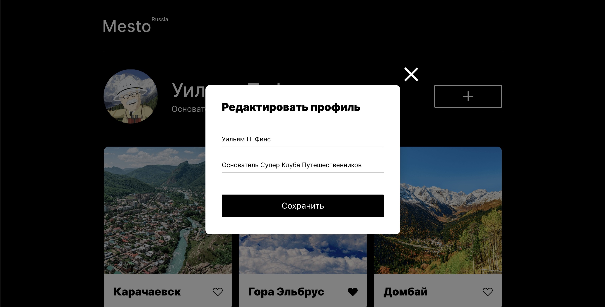

# Проект: Место (React-версия)

### Обзор
Социалочка для путешественников (версия на Реакте)!
В данной версии проекта применялся фреймворк React. Функционал пока чуть более ограничен, в отличае от версии написанной на "святой троице", но скоро это изменится.

## Какие техники применялись:

* HTML
* CSS - гриды, флексы, адаптивная верстка
* JavaScript - взаимодействие с DOM. Передача значений введенных пользователем в формы. Работа с PopUp-элементами сайта. Работа с API.
* React - хуки, рефы, стейт переменные и структуризация проекта.
* GIT - разработка с ветками и по стандарту Conventional Commits
* БЭМ - файловая структура по данному стандарту

## Что планирую доработать:
* Восстановить функционал валидации форм